# Workshop UnrealEngine Part 4

## Introduction

Bienvenue dans ce workshop UnrealEngine.

Dans ce workshop, nous allons apprendre utiliser le Blueprint, le langage de programmation visuel d'UnrealEngine.

Pour cela, nous allons créer une lampe que nous pourrons allumer et éteindre ainsi qu'une possibilité pour notre joueur de s'accroupir et courir.

Ce workshop est découpé en 4 parties :

- Partie 1 : [Création/Sculpture/Peinture du terrain](https://github.com/Kenan-Blasius/Workshop-UnrealEngine-Part-1)
- Partie 2 : [Création de décors](https://github.com/Kenan-Blasius/Workshop-UnrealEngine-Part-2)
- Partie 3 : [Importation de model exterieur/Création de particule](https://github.com/Kenan-Blasius/Workshop-UnrealEngine-Part-3)
- Partie 4 (ce workshop) : [Apprentissage du Blueprint](https://github.com/Kenan-Blasius/Workshop-UnrealEngine-Part-4)

## Création de la lampe

Tout d'abbord, avant de créer notre lampe interactif par notre joueur, il nous faut définir le point de départ de notre joueur.

Pour cela rendez-vous dans le dossier `All` et cherchez `PlayerStart` et placez-le dans votre niveau.

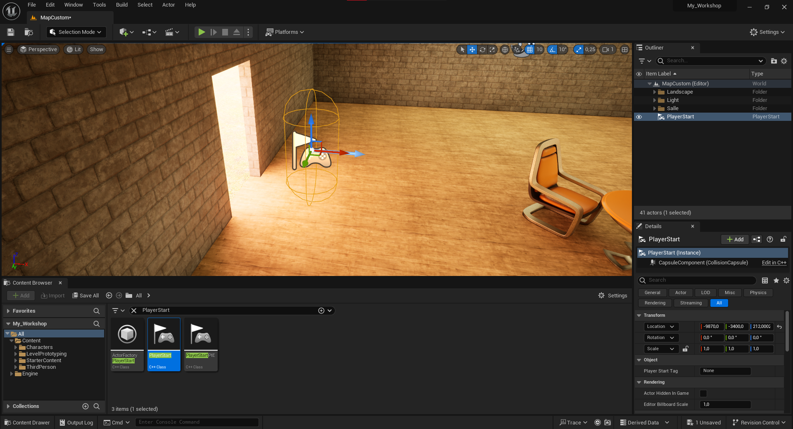

Maintenant quand vous cliquerez sur `Play` vous commencerez à l'endroit où vous avez placé le `PlayerStart`.

Maintenant que nous avons défini le point de départ de notre joueur, nous allons créer notre lampe.

Pour cela, rendez-vous dans le dossier `All/Content` et créez un nouveau Blueprint de type `Actor`.

Ouvrez votre Blueprint et ajoutez une `SM_Lamp_Ceiling` (présent dans `StarterContent/Props`) ainsi qu'une `SpotLight`, dans votre Blueprint.

Ajoutez votre lampe au-dessus de votre table pour voir le rendu.

Maintenant, ajoutez une `Sphere Collision` definissez sa taille à `450` et placez-la au niveau de l'ampoule de votre lampe.

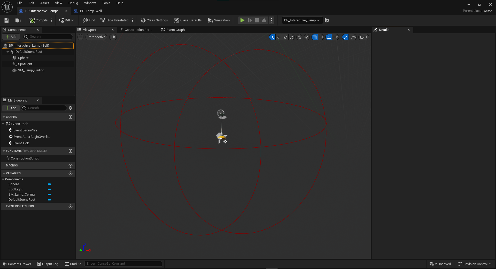

Maintenant, nous allons créer le Blueprint de notre lampe nous permettant de l'allumer et de l'éteindre.

Pour cela, rendez-vous dans l'event graph de votre Blueprint et ajoutez un `Event OnComponentBeginOverlap` et un `Event OnComponentEndOverlap` sur votre `Sphere Collision`.

Ajoutez ensuite des `Print String` dans ces deux events afin de pouvoir voir quand notre joueur est à proximité de notre lampe.

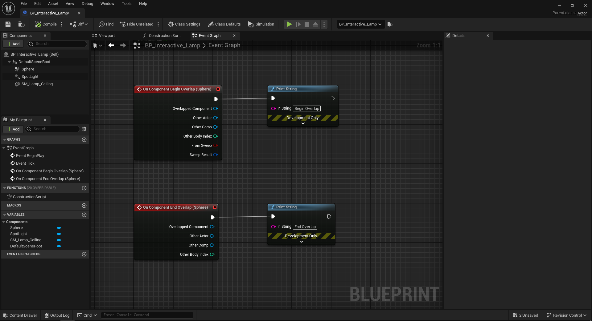

> [!tip]
>
> Retournez dans votre niveau et... vous verrez plein d'éléments sur la vue 3D de votre niveau.
>
> 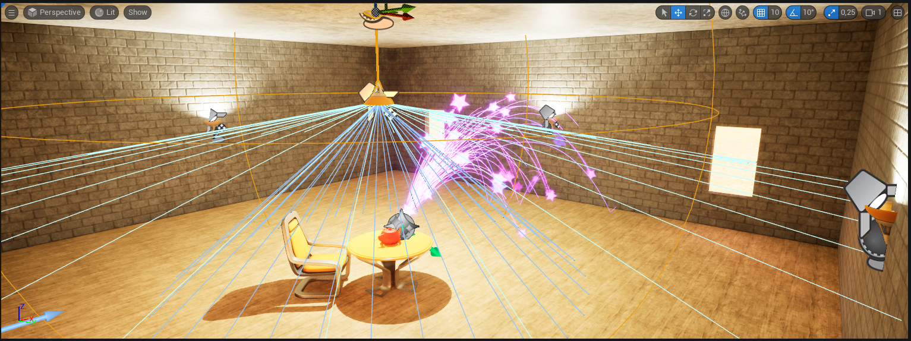
>
> Pour rendre cela plus lisible, rendez-vous dans `Outliner` et cliquez sur votre théière et à gauche vous aurrez un petit oeil, cliquez dessus pour le cacher.
>
> Ne vous inquitez pas, cela ne cache pas votre théière dans le jeu mais uniquement dans l'éditeur.
>
> 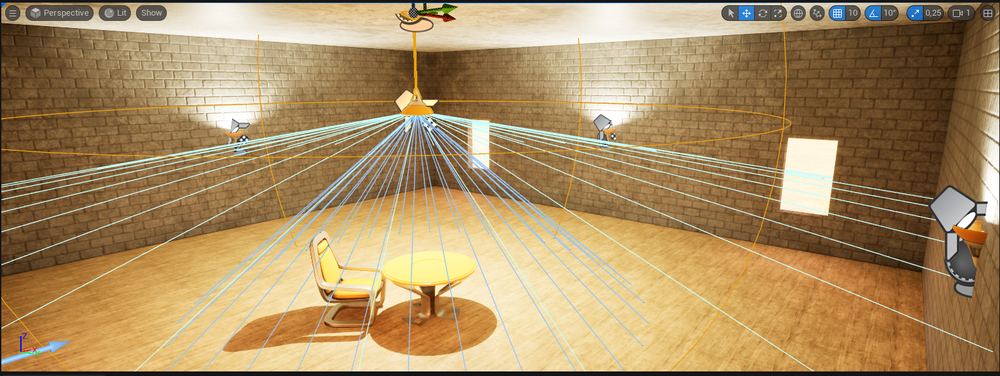

Maintenant, faites `Play` et approchez-vous et élignez-vous de votre lampe et vous verrez que les `Print String` s'affichent en haut à gauche de votre écran.

Retournons dans notre Blueprint et modifions nos évènements afin d'allumer la lumière de notre lampe quand notre joueur est à proximité et de l'éteindre quand il s'en éloigne.

Pour cela, ajoutez un `Set Visibility` dans votre `Event OnComponentBeginOverlap` et un `Set Visibility` dans votre `Event OnComponentEndOverlap`.

Connectez votre `SpotLight` à votre `Set Visibility` et mettez la visibilité à `true` dans votre `Event OnComponentBeginOverlap` et à `false` dans votre `Event OnComponentEndOverlap`.

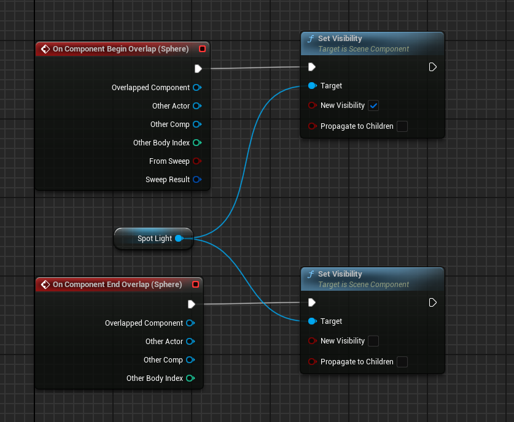

Nous allons maintenant ajouter un texte au-dessus de notre lampe nous indiquant que nous pouvons l'allumer et l'éteindre.

Pour cela, nous allons créer un `Widget Blueprint`, pour ce faire rendez-vous dans le dossier `All/Content` et créez un nouveau `User Interface` > `Widget Blueprint`.

Ouvrez votre `Widget Blueprint`, ajoutez un `Canvas Panel` puis un `Text` dans votre `Canvas Panel`.

Maintenant, dans les détails de votre `Text`:

- Modifiez l'`Anchors` en cliquant afin de le centrer
- Modifiez la position en X à `0`
- Modifiez la position en Y à `0`
- Modifiez l'aligment en X à `0.5`
- Modifiez l'aligment en Y à `0.5`

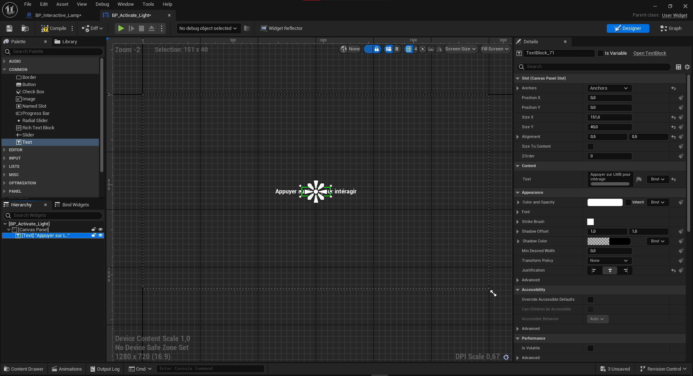

Maintenant, nous allons ajouter notre `Widget Blueprint` à notre lampe.

Pour cela, retournez dans votre Blueprint et ajoutez un `Widget` dans votre `Viewport` et sélectionnez votre `Widget Blueprint` dans `Widget Class`, puis modifiez `Space` en `Screen`.

Cochez `Hidden in Game` afin de ne pas voir votre `Widget` dans le jeu.

Puis, rendez visible votre `Widget` dans votre `Event OnComponentBeginOverlap` et rendez-le invisible dans votre `Event OnComponentEndOverlap`.

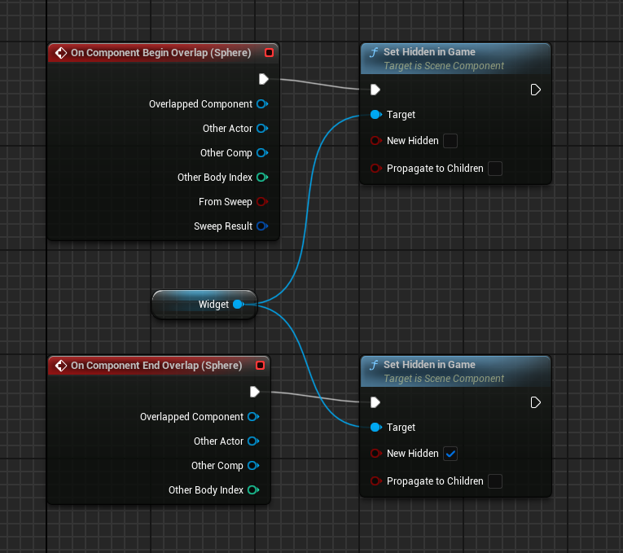

Nous allons maintenant créer notre première variable.

Cette variable va nous permettre de savoir si notre joueur est à proximité de notre lampe ou non.

Pour cela, retournez dans votre Blueprint et ajoutez une variable de type `Boolean` et nommez-la `IsPlayerNear`.

Définissez sa valeur par défaut à `false` et définissez sa valeur à `true` dans votre `Event OnComponentBeginOverlap` et à `false` dans votre `Event OnComponentEndOverlap`, tout en gardant l'affichage de votre `Widget` dans ces deux évènements.

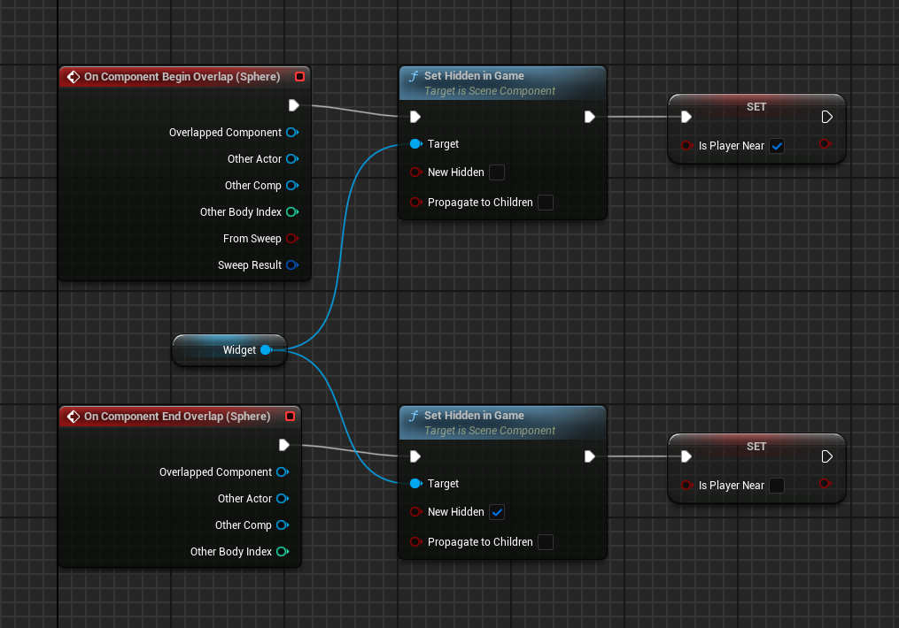

Ajoutez maintenant un event `Left Mouse Button` et lorsque le joueur appuiera sur le bouton gauche de sa souris, nous allons allumer ou éteindre notre lampe SI notre joueur est à proximité de notre lampe.

> [!tip]
> Pour faire un `if` dans le Blueprint, faites un clic droit et cherchez `Branch` et ajoutez-le dans votre Blueprint.

Et... votre lampe ne fonctionne pas, ou plus précisement, votre clique gauche ne fonctionne pas.

C'est normal, nous n'avons pas dit à UnrealEngine que notre lampe récupére les inputs de notre joueur.

Pour cela, ajouter à votre `Event BeginPlay` un `Enable Input` et ajouter une node `Get Player Controller` et connectez-la à votre `Enable Input`.

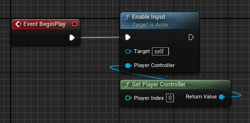

Quand à votre `Left MouseButton`, il doit ressembler à ça :

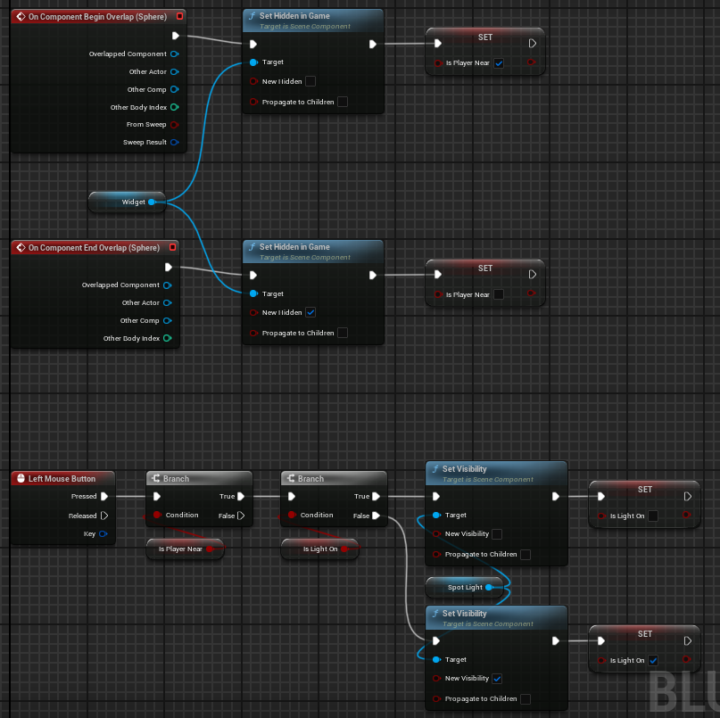

Et voilà, vous avez créé votre lampe interactive.
